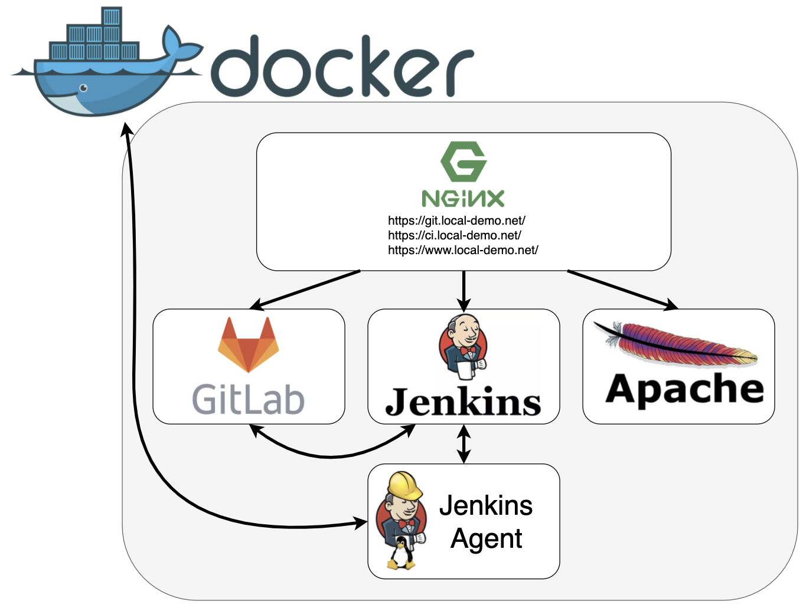

# Docker Local Demo

1. [Overview](#1-overview)
1. [Prerequisites](#2-prerequisites)
1. [Setup](#3-setup)
1. [Certificates](#4-certificates)
1. [Hosts file](#5-hosts-file)
1. [Prepare the Docker environment](#6-prepare-the-docker-environment)
1. [Run the load balancer](#7-run-the-load-balancer)
1. [Run GitLab](#8-run-gitlab)
1. [Run the Jenkins Master](#9-run-the-jenkins-master)
1. [Run the Jenkins Slave](#10-run-the-jenkins-slave)


## 1. Overview

This project is meant to demo the operations of working with Docker, Jenkins, GitLab, and reverse proxies - all on your laptop. The tutorial walks you through building five Docker containers:
1. `load-balancer` - Nginx that will act as a reverse proxy to expose other Docker services. Nginx will be setup to listen on ports 80 and 443 on localhost.
1. `web-app` - a demo website with static HTML/CSS/JavaScript running via Apache.
1. `gitlab` - demo source code will be added to GitLab and used to build and deploy our demo web app.
1. `jenkins-master` - the Jenkins master will provide the web interface for managing Jenkins.
1. `jenkins-slave1` - The Jenkins slave will be used by the Jenkins master to do work such as checking out source code and building/running Docker images.


TODO: discuss project folder structure


## 2. Prerequisites

This document will be written for Windows, but it is hoped that it can easily be followed by someone on a Mac. The software that this tutorial uses is:
 - [Docker Desktop for Windows](https://store.docker.com/editions/community/docker-ce-desktop-windows)
 - [Git](https://git-scm.com/downloads)
 - [Bash for Windows](https://docs.microsoft.com/en-us/windows/wsl/install-win10) (Optional) with OpenSSL


## 3. Setup

Once you have installed the prerequisites. The only setup you have to do is clone this repository and cd in the directory.

```
git clone git@git.dartmouth.edu:containerization/docker-local-demo.git
cd docker-local-demo
```

## 4. Certificates

The project includes precreated certificates in the `resources` directory. If you wish to use the precreated certificates you can skip the rest of this step.

```powershell
cp resources/load-balancer/*.crt volumes/load-balancer
cp resources/load-balancer/*.key volumes/load-balancer
```

If you wish to create your own certificates, here is an example doing that. Note that OpenSSL on Windows does not appear to support SAN certificates so this needs to be done in Bash for Windows.

```bash
# Run in Bash for Windows
cd /mnt/c/dartbox/Code/containerization/docker-local-demo/volumes/load-balancer

openssl genrsa -out local-demo-net-ca.key 4096
openssl req -new -x509 -days 3650 -key local-demo-net-ca.key -subj "/C=US/ST=State/L=City/O=Organization/OU=Org Unit/CN=Localhost Root CA" -out local-demo-net-ca.crt

openssl req -newkey rsa:4096 -nodes -keyout local-demo-net.key -subj "/C=US/ST=State/L=City/O=Organization/OU=Org Unit/CN=*.local-demo.net" -out local-demo-net.csr

openssl x509 -req -extfile <(printf "subjectAltName=DNS:*.local-demo.net,DNS:local-demo.net,DNS:localhost") -days 3650 -in local-demo-net.csr -CA local-demo-net-ca.crt -CAkey local-demo-net-ca.key -CAcreateserial -out  local-demo-net.crt

cd ../../..
```

After the certificates are in place, import the CA as a trusted root certificate authority.

```powershell
# Run as administrator in PowerShell 5
Import-Certificate -FilePath "$pwd\volumes\load-balancer\local-demo-net-ca.crt" -CertStoreLocation "cert:\CurrentUser\Root"
```

## 5. Hosts file

Update your hosts file

```powershell
# Run as administrator
echo "`r`n127.0.0.1  local-demo.net www.local-demo.net git.local-demo.net ci.local-demo.net" >> C:\Windows\System32\drivers\etc\hosts
```

## 6. Prepare the Docker environment

Setup a Docker network for all your containers to use

```powershell
docker network create docker-local-demo
```

Create a set of local volumes for GitLab to use. Note GitLab will not work if we map these volumes to Windows.

```
docker volume create --name gitlab-config-volume -d local
docker volume create --name gitlab-logs-volume -d local
docker volume create --name gitlab-opt-volume -d local
```

Pull the Docker base images
```
docker pull nginx:latest
docker pull gitlab/gitlab-ce:10.8.7-ce.0
docker pull jenkins/jenkins:2.121.2
```


## 7. Run the load balancer


Copy the nginx conf into place

```powershell
cp resources/load-balancer/nginx.conf volumes/load-balancer
```

```powershell
docker run -d `
--name load-balancer `
--network=docker-local-demo `
--restart unless-stopped `
-p 80:80 `
-p 443:443 `
-v $pwd/volumes/load-balancer/local-demo-net.crt:/etc/nginx/certs/local-demo-net.crt:ro `
-v $pwd/volumes/load-balancer/local-demo-net.key:/etc/nginx/certs/local-demo-net.key:ro `
-v $pwd/volumes/load-balancer/nginx.conf:/etc/nginx/nginx.conf:ro `
nginx:latest
```

You can test the following URLs:
 - [https://local-demo.net/](https://local-demo.net/)
 - [https://www.local-demo.net/](https://www.local-demo.net/)
 - [https://git.local-demo.net/](https://git.local-demo.net/)
 - [https://ci.local-demo.net/](https://ci.local-demo.net/)
 - (redirect) [http://local-demo.net/](http://local-demo.net/)
 - (redirect) [http://www.local-demo.net/](http://www.local-demo.net/)
 - (redirect) [http://git.local-demo.net/](http://git.local-demo.net/)
 - (redirect) [http://ci.local-demo.net/](http://ci.local-demo.net/)


## 8. Run GitLab

Create and run the GitLab container

```
docker run -d `
--name gitlab `
--network docker-local-demo `
--restart unless-stopped `
-p 8081:443 `
-p 8082:80 `
-p 4008:22 `
-v "gitlab-config-volume:/etc/gitlab" `
-v "gitlab-logs-volume:/var/log/gitlab" `
-v "gitlab-opt-volume:/var/opt/gitlab" `
--hostname git.local-demo.net `
--env GITLAB_OMNIBUS_CONFIG="external_url 'https://git.local-demo.net'; gitlab_rails['gitlab_shell_ssh_port']=22;" `
gitlab/gitlab-ce:10.8.7-ce.0
```

Enter the container and create a self-signed certificate

```
docker exec -it gitlab bash

mkdir -p /etc/gitlab/ssl
chmod 700 /etc/gitlab/ssl

openssl req -x509 -nodes -days 3650 -newkey rsa:2048 -subj "/C=US/ST=State/L=City/O=Organization/OU=Org Unit/CN=GitLab" -keyout /etc/gitlab/ssl/git.local-demo-net.key -out /etc/gitlab/ssl/git.local-demo-net.crt

# reconfigure Omnibus GitLab
gitlab-ctl reconfigure
```

## 9. Run the Jenkins Master

Create the Jenkins master.

```
docker run -d `
--name jenkins-master `
--restart unless-stopped `
--env JENKINS_SLAVE_AGENT_PORT=50001 `
-v "$pwd/volumes/jenkins-master:/var/jenkins_home" `
-p 8080:8080 `
-p 38443:8443 `
-p 50001:50001 `
--network docker-local-demo `
jenkins/jenkins:2.121.2
```


## 10. Run the Jenkins Slave

Create the Jenkins slave

```
cd "resources/jenkins-slave"
docker build -t jenkins-slave .
cd ../..
mkdir volumes/jenkins-slave1

docker run -d `
--name jenkins-slave1 `
--restart unless-stopped `
-e JENKINS_REMOTE_ROOT_DIR='/var/jenkins' `
-e JENKINS_JNLP_URL='http://jenkins-master:8080/computer/jenkins-slave1/slave-agent.jnlp' `
-e TZ=America/New_York `
-e JENKINS_SECRET=c1b90fded8a905202c7bc741b07cdd4cd576a3b0dade9305d27a2d2aa739daa9 `
-v /usr/local/bin/docker:/usr/bin/docker `
-v /var/run/docker.sock:/var/run/docker.sock `
-v "$pwd\volumes\jenkins-slave1:/var/jenkins" `
--network docker-local-demo `
jenkins-slave
```

## 11. Rough steps

Added SSH key to Git
Created a project at git@git.local-demo.net:root/www-local-demo-net.git

```
cd ..
git clone ssh://git@git.local-demo.net:4008/root/www-local-demo-net.git

cp docker-local-demo/resources/www-local-demo-net/* www-local-demo-net

cd www-local-demo-net

docker build -t www-local-demo-net:latest .

docker run -d `
--name www-local-demo-net `
--restart unless-stopped `
--network docker-local-demo `
www-local-demo-net:latest
```

* Create SSH keys for the account

```
ssh-keygen -t rsa -C "no-reply+jenkins-svc@dartmouth.edu" -b 4096
jenkins-svc
cat jenkins-svc.pub | clip
```

- Creat service account in Git
  - Go to [your git](https://git.local-demo.net/admin/users/new)
  - username/name = jenkins-svc
  - email = no-reply@dartmouth.edu
  - impersonate > settings > ssh keys

- Add the private key to Jenkins
  - Go to [ci](ci.dartmouth.edu)
  - Credentials > pull down global > add credentials
    SSH username with private key
    add directly
    username = jenkins-svc
    ID = jenkins-svc

- Add jenkins-svc to project


- Create a Jenkins pipeline
  - Go [your ci](https://ci.local-demo.net/)
  New item > pipeline
  name = www-local-demo-net
  enter
  pipeline definition = Pipeline script from SCM
  repo = git
  ssh:

    ```
    git@gitlab:root/www-local-demo-net.git
    ```


- Create a Jenkinsfile

- Add plugins
  - ssh agent
