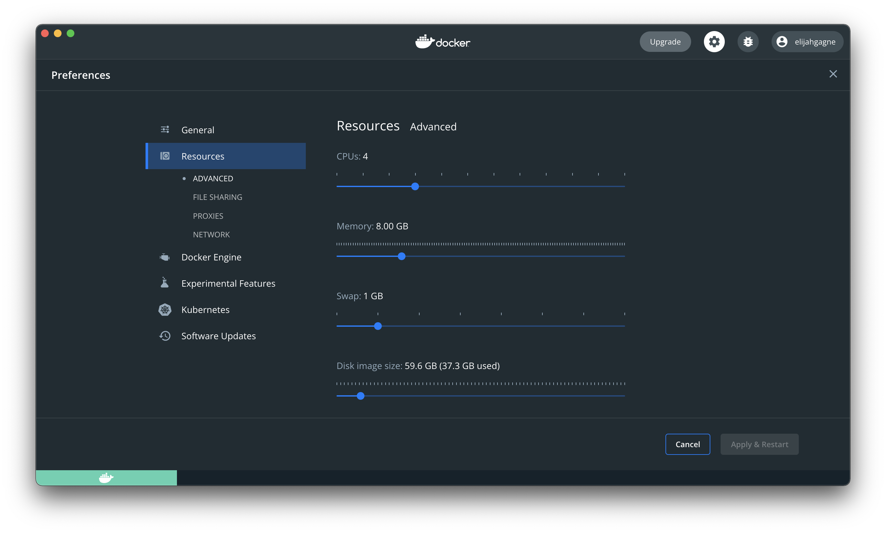

# Docker Local Demo

1. [Overview](#1-overview)
1. [Prerequisites](#2-prerequisites)
1. [Setup](#3-setup)
1. [Certificates](#4-certificates)
1. [Hosts file](#5-hosts-file)
1. [Prepare the Docker environment](#6-prepare-the-docker-environment)
1. [Run the load balancer](#7-run-the-load-balancer)
1. [Run GitLab](#8-run-gitlab)
1. [Run the Jenkins Controller](#9-run-the-jenkins-controller)
1. [Log into GitLab and configure it](#10-log-into-gitlab-and-configure-it)
1. [Log into Jenkins and configure it](#11-log-into-jenkins-and-configure-it)
1. [Build and run the Jenkins agent](#12-build-and-run-the-jenkins-agent)
1. [Create a new GitLab project](#13-create-a-new-gitlab-project)
1. [Create the WWW container](#14-create-the-www-container)
1. [Install the GitLab plugin for Jenkins](#15-install-the-gitlab-plugin-for-jenkins)
1. [Create a Jenkins pipeline to update your website](#16-create-a-jenkins-pipeline-to-update-your-website)
1. [Create a web hook for your GitLab project](#17-create-a-web-hook-for-your-gitlab-project)
1. [Make an update to your website and kick off the pipeline](#18-make-an-update-to-your-website-and-kick-off-the-pipeline)

## 1. Overview

This project is meant to demo the operations of working with Docker, Jenkins, GitLab, and reverse proxies - all on your laptop. The tutorial walks you through building five Docker containers:
1. `load-balancer` - Nginx that will act as a reverse proxy to expose other Docker services. Nginx will be setup to listen on ports 80 and 443 on localhost.
1. `web-app` - a demo website with static HTML/CSS/JavaScript running via Apache.
1. `gitlab` - demo source code will be added to GitLab and used to build and deploy our demo web app.
1. `jenkins-controller` - the Jenkins controller will provide the web interface for managing Jenkins.
1. `jenkins-agent1` - The Jenkins agent will be used by the Jenkins master to do work such as checking out source code and building/running Docker images.


TODO: discuss project folder structure

## 2. Prerequisites

This document will be written for Windows using the Windows Subsytem for Linux (WSL), but it is hoped that it can easily be followed by someone on a Mac. The software that this tutorial uses is:
 - [Docker Desktop](https://store.docker.com/editions/community/docker-ce-desktop-windows)
 - [Git](https://git-scm.com/downloads)
 - [WSL](https://docs.microsoft.com/en-us/windows/wsl/install-win10)

## 3. Setup

Once you have installed the prerequisites. The only setup you have to do is clone this repository and cd in the directory.

```bash
git clone git@git.dartmouth.edu:containerization/docker-local-demo.git
cd docker-local-demo
```

Then create directories to store persistent data
```bash
mkdir -p volumes/load-balancer
mkdir volumes/gitlab
mkdir volumes/jenkins-controller
mkdir volumes/jenkins-svc
mkdir volumes/www
```

## 4. Certificates

The project includes precreated certificates in the `resources` directory. You can use the precreated certificated by doing the following:

```bash
cp resources/load-balancer/*.crt volumes/load-balancer
cp resources/load-balancer/*.key volumes/load-balancer
cp resources/gitlab/*.crt volumes/gitlab
cp resources/gitlab/*.key volumes/gitlab
cp resources/jenkins-svc/* volumes/jenkins-svc
chmod 600 volumes/jenkins-svc/*
```

Or, if you wish to create your own certificates, here is an example doing that. Note that OpenSSL on Windows does not appear to support SAN certificates so this needs to be done in WSL.

```bash
cd volumes/load-balancer

# Create a certificate authority
openssl genrsa -out local-demo-net-ca.key 4096
openssl req -new -x509 -sha256 -days 3650 -key local-demo-net-ca.key -subj "/C=US/ST=State/L=City/O=Organization/OU=Org Unit/CN=Localhost Root CA" -out local-demo-net-ca.crt

# Create a wildcard certificate request
openssl req -sha256 -newkey rsa:4096 -nodes -keyout local-demo-net.key -subj "/C=US/ST=State/L=City/O=Organization/OU=Org Unit/CN=*.local-demo.net" -out local-demo-net.csr

# Create a wildcard certificate
openssl x509 -sha256 -req -extfile <(printf "subjectAltName=DNS:*.local-demo.net,DNS:local-demo.net,DNS:localhost") -days 3650 -in local-demo-net.csr -CA local-demo-net-ca.crt -CAkey local-demo-net-ca.key -CAcreateserial -out  local-demo-net.crt

# Clean up temporary files
rm -f local-demo-net-ca.srl local-demo-net.csr

cd ../gitlab

# Create a self-signed certificate for GitLab to use for encryption
openssl req -x509 -sha256 -nodes -days 3650 -newkey rsa:2048 -subj "/C=US/ST=State/L=City/O=Organization/OU=Org Unit/CN=GitLab" -keyout git.local-demo-net.key -out git.local-demo-net.crt

cd ../jenkins-svc
# Create a SSH key for a Jenkins service account to authenticate to GitLab
ssh-keygen -t rsa -C "no-reply+jenkins-svc@local-demo.net" -b 4096
./jenkins-svc
<Enter>
<Enter>

cd ../..
```

After the certificates are in place, import the CA as a trusted root certificate authority.
Windows
```powershell
# Run as administrator in PowerShell 5

# Update the path accordingly
cd "~\Desktop\docker-local-demo"

Import-Certificate -FilePath "$pwd\volumes\load-balancer\local-demo-net-ca.crt" -CertStoreLocation "cert:\CurrentUser\Root"
```

Mac
```bash
sudo security add-trusted-cert -d -r trustRoot -k /Library/Keychains/System.keychain volumes/load-balancer/local-demo-net-ca.crt
```

## 5. Hosts file

Update your hosts file

**Windows**

```powershell
# Run as administrator in PowerShell 5

echo "`r`n127.0.0.1   local-demo.net www.local-demo.net git.local-demo.net ci.local-demo.net" | out-file "C:\Windows\System32\drivers\etc\hosts" -encoding ascii -append
```

**Mac**

```bash
sudo bash -c 'printf "\n127.0.0.1   local-demo.net www.local-demo.net git.local-demo.net ci.local-demo.net\n" >> /private/etc/hosts'
```

## 6. Prepare the Docker environment

Consider updating your Docker Desktop settings to give Docker more CPU and RAM. Here is how an example configuration.



Setup a Docker network for all your containers to use

```bash
docker network create docker-local-demo
```

Create a set of local volumes for GitLab to use. Note GitLab will not work if we map these volumes to Windows.

```bash
docker volume create --name gitlab-config-volume -d local
docker volume create --name gitlab-logs-volume -d local
docker volume create --name gitlab-opt-volume -d local
```

Pull the Docker base images

```bash
docker pull nginx:latest
docker pull gitlab/gitlab-ce:11.6.3-ce.0
docker pull jenkins/jenkins:lts
```

## 7. Run the load balancer

Copy the nginx conf into place

```bash
cp resources/load-balancer/nginx.conf volumes/load-balancer
```

```bash
docker run -d \
--name load-balancer \
--network=docker-local-demo \
-p 80:80 \
-p 443:443 \
-v $PWD/volumes/load-balancer/local-demo-net.crt:/etc/nginx/certs/local-demo-net.crt:ro \
-v $PWD/volumes/load-balancer/local-demo-net.key:/etc/nginx/certs/local-demo-net.key:ro \
-v $PWD/volumes/load-balancer/nginx.conf:/etc/nginx/nginx.conf:ro \
nginx:latest
```

You can test the following URLs:
 - [https://local-demo.net/](https://local-demo.net/)
 - [https://www.local-demo.net/](https://www.local-demo.net/)
 - [https://git.local-demo.net/](https://git.local-demo.net/)
 - [https://ci.local-demo.net/](https://ci.local-demo.net/)
 - (redirect) [http://local-demo.net/](http://local-demo.net/)
 - (redirect) [http://www.local-demo.net/](http://www.local-demo.net/)
 - (redirect) [http://git.local-demo.net/](http://git.local-demo.net/)
 - (redirect) [http://ci.local-demo.net/](http://ci.local-demo.net/)

## 8. Run GitLab

Copy the GitLab conf into place

```bash
cp resources/gitlab/gitlab.rb volumes/gitlab
```

Create and run the GitLab container

```bash
docker run -d \
--name gitlab \
--network docker-local-demo \
-p 8081:443 \
-p 8082:80 \
-p 4008:22 \
-v "gitlab-config-volume:/etc/gitlab" \
-v "gitlab-logs-volume:/var/log/gitlab" \
-v "gitlab-opt-volume:/var/opt/gitlab" \
-v $PWD/volumes/gitlab/local-demo-net.crt:/etc/gitlab/ssl/git.local-demo-net.crt:ro \
-v $PWD/volumes/gitlab/local-demo-net.crt:/etc/gitlab/ssl/git.local-demo-net.key:ro \
-v $PWD/volumes/gitlab/gitlab.rb:/etc/gitlab/gitlab.rb \
--hostname git.local-demo.net \
gitlab/gitlab-ce:11.6.3-ce.0
```

GitLab will startup and build out the initial configuration. Afterwards, it will try to restart it self. Unfortunately this results in a stopped container because GitLab doesn't expect a need to restart the container. Wait for this to happen and then manually restart the container.

```bash
# Watch the progress
docker logs -f gitlab

# Start the cotainer again
docker start gitlab
```

## 9. Run the Jenkins Controller

Create the Jenkins controller.

```bash
docker run -d \
--name jenkins-controller \
--env JENKINS_SLAVE_AGENT_PORT=50001 \
-v $PWD/volumes/jenkins-controller:/var/jenkins_home \
-p 8080:8080 \
-p 38443:8443 \
-p 50001:50001 \
--network docker-local-demo \
jenkins/jenkins:lts
```

## 10. Log into GitLab and configure it

- Browse to [https://git.local-demo.net/](https://git.local-demo.net/) and set a root password.
- Then log in with the root account.
- At the top, click the `wrench` icon.
- On the left, click `Users`.
- Click `New user`.
- Set the following:
```text
Name: jenkins-svc
Username: jenkins-svc
Email: no-reply+jenkins-svc@local-demo.net

# Leave all the rest with the default settings
```
- Click `Create user`.
- Click `Impersonate`.
- In the top right, click the user icon and select `Settings`.
- On the left, click `SSH Keys`.
- Copy the SSH key you generated in step 4 to your clipboard.
```bash
cat volumes/jenkins-svc/jenkins-svc.pub | clip.exe
```
- Paste the key into the web page and click `Add key`.
- In the top left, click the `Stop impersonation` button.

## 11. Log into Jenkins and configure it

- Get the initial root password
```bash
docker exec jenkins-controller cat /var/jenkins_home/secrets/initialAdminPassword | clip.exe
```

- Browse to [https://ci.local-demo.net/](https://ci.local-demo.net/) and log in with the root password.
- Click `Select plugins to install` and choose the following:
  - Folders
  - Build timeout
  - Credential Binding
  - Timestamper
  - Workspace cleanup
  - Pipeline
  - Pipeline: Stage View
  - Git
  - SSH Build Agents
- Click `Install`
After the plugins are installed, enter the following:
```text
Username: admin
Password: REMOVED
Confirm password: REMOVED
Full name: admin
E-mail address: admin@local-demo.net
```
- Click `Save and Continue`. The Jenkins URL should be `http://jenkins-controller:8080/`.
- Click `Save and Finish`.
- Click `Start using Jenkins`
- Click `Manage Jenkins`.
- Click `Manage Nodes`.
- Click `New Node`.
- Set the node name to be `jenkins-agent1` and check `Permanent Agent`.
- Click `OK`.
- Set the follow attributes:
```text
Name: jenkins-agent1
Description: <blank>
# of executors: 2
Remote root directory: /var/jenkins
Labels: dev
Usage: Only build jobs with label expressions matching this node
Launch method: Launch agent by connecting it to the master
Disable WorkDir: <checked>
Custom WorkDir path: <blank>
Internal data directory: remoting
Fail if workspace is missing: <unchecked>
Availability: Keep this agent online as much as possible
Disable deferred wipeout on this node: <unchecked>
Environment variables: <unchecked>
Tool Locations: <unchecked>
```
- Click `Save`.
- Click `jenkins-agent1`.
- There should be an example command to start agent that looks like
```bash
java -jar agent.jar -jnlpUrl http://jenkins-controller:8080/computer/jenkins-agent1/jenkins-agent.jnlp -secret 9f07952b81c190d62e1453f4406cf805e09dd28295d73f3665749cd5a1a1789a
```
- Copy out the secret and set it as a variable. For example:
```bash
AGENT_SECRET=9f07952b81c190d62e1453f4406cf805e09dd28295d73f3665749cd5a1a1789a
```
- Go back to `Jenkins > Nodes`. The node `jenkins-agent1` will show as offline.

## 12. Build and run the Jenkins agent

Create the Jenkins agent

```bash
chmod 774 resources/jenkins-agent/docker-entrypoint.sh
cd resources/jenkins-agent
docker build -t jenkins-agent .
cd ../..
```

** Windows **

```bash
docker run -d \
--name jenkins-agent1 \
-e JENKINS_REMOTE_ROOT_DIR=/var/jenkins \
-e JENKINS_JNLP_URL='http://jenkins-controller:8080/computer/jenkins-agent1/jenkins-agent.jnlp' \
-e TZ=America/New_York \
-e JENKINS_SECRET=$AGENT_SECRET \
-v /usr/local/bin/docker:/usr/bin/docker \
-v /var/run/docker.sock:/var/run/docker.sock \
--network docker-local-demo \
jenkins-agent
```

** Mac **

```bash
docker run -d \
--name jenkins-agent1 \
-e JENKINS_REMOTE_ROOT_DIR=/var/jenkins \
-e JENKINS_JNLP_URL='http://jenkins-controller:8080/computer/jenkins-agent1/jenkins-agent.jnlp' \
-e TZ=America/New_York \
-e JENKINS_SECRET=$AGENT_SECRET \
-v /var/run/docker.sock:/var/run/docker.sock \
--network docker-local-demo \
jenkins-agent
```

Back in the web browser, refresh the `Jenkins > Nodes` page and you should now see the node online.

## 13. Create a new GitLab project

- Browse to [https://git.local-demo.net/](https://git.local-demo.net/).
- Under the plus sign, select `New project`.
- Set the name to `www` and leave all the defaults.
- Click `Create project`.
- Click `Settings` and then `Members`.
- Select `jenkins-svc` and give them the `Maintainer` role.
- Click `Add to project`.
- Clone the repository locally
```bash
# Set git to use the jenkins-svc key
export GIT_SSH_COMMAND="ssh -i $PWD/volumes/jenkins-svc/jenkins-svc"

# Copy over a starter website
cd volumes/www
cp ../../resources/www/* .

# Create a git repository and connect it to the project created in GitLab
git init
git remote add origin ssh://git@git.local-demo.net:4008/root/www
git add .
git commit -m "Initial commit"

# Push the changes to GitLab
# Accept the host fingerprint
git push -u origin master
```

## 14. Create the WWW container

```bash
docker build -t www:latest .

docker run -d \
--name www \
--network docker-local-demo \
www:latest

cd ../..
```

Browse to [https://www.local-demo.net/](https://www.local-demo.net/) and you should see the message "Hello world".

## 15. Install the GitLab plugin for Jenkins

- Browse to [https://ci.local-demo.net/](https://ci.local-demo.net/).
- Click `Manage Jenkins`.
- Click `Manage Plugins`.
- Switch to the `Available` tab.
- In the filter, enter `GitLab`.
- Check the `GitLab` plugin and click `Install without restart`.
- Check `Restart Jenkins when installation is complete and no jobs are running`.
- Wait for Jenkins to restart. After it has restarted, start up the agent.

```bash
docker start jenkins-agent1
```

## 16. Create a Jenkins pipeline to update your website

Create a local-demo folder
- Browse to [https://ci.local-demo.net/](https://ci.local-demo.net/).
- Click `New Item`.
- Set the name to `local-demo`, the type to `Folder`, and click `OK`.

Add the jenkins-svc key
- In the top left, click `local-demo`.
- On the left, click `Credentials`.
- On the drop down under `global` select `Add credentials`.
- Copy the jenkins-svc private key to your clipboard.
```bash
cat volumes/jenkins-svc/jenkins-svc | clip.exe
```
- Set the following:
```text
Kind: SSH Username and with private key
Username: git
Private key: Enter directly
Key: <paste from clipboard>
Passphrase: <blank>
ID: jenkins-svc-key
Description: jenkins-svc-key
```
- Click `OK`.

Create the pipeline
- In the top left, click `local-demo`.
- Click `New Item`.
- Set the name to `www`, the type to `Pipeline`, and click `OK`.
- Under `Build Triggers` check `Build when a change is pushed to GitLab. GitLab webhook URL: https://ci.local-demo.net/project/local-demo/www`
- Remove the text from `Comment (regex) for triggering a build`
- Click `Advanced`
- Under `Secret token` click Secret Token and note down the value (e.g. `437dade2a29ce753bfe4e863708e8a31`)
- Under `Pipeline` set the following:
```text
Definition: Pipeline script from SCM
SCM: Git
Repository URL: git@gitlab:root/www.git
Credentials: git (jenkins-svc GitLab key)

# Leave all the settings with the default values
```
- Click `Save`.

## 17. Create a web hook for your GitLab project

Allow webhooks to localhost
- Browse to [https://git.local-demo.net/admin/application_settings/network](https://git.local-demo.net/admin/application_settings/network)
- Expand `Outbound requests`.
- Check `Allow requests to the local network from hooks and services`.
- Click `Save changes`.

Create a webhook for your project
- Browse to [https://git.local-demo.net/root/www/settings/integrations](https://git.local-demo.net/root/www/settings/integrations).
- Set the following:
```text
URL: http://jenkins-controller:8080/project/local-demo/www
Secret token: 437dade2a29ce753bfe4e863708e8a31
Enable SSL verification: unchecked

# Leave all the settings with the default values
```
- Click `Add webhook`.

## 18. Make an update to your website and kick off the pipeline

Browse to [https://git.local-demo.net/root/www](https://git.local-demo.net/root/www) so that you can watch your updated code.

Browse to [https://ci.local-demo.net/job/local-demo/job/www/](https://ci.local-demo.net/job/local-demo/job/www/) so that you can watch your job run.

Then do the following:
```bash
cd volumes/www
vi index.html
# Add some text after Hello world
# save the file (:wq)

# Stage, commit, and push your changes
git add -A
git commit -m "Updated hello"
git push
```

Browse to [https://www.local-demo.net/](https://www.local-demo.net/) to view your changes.


# Other notes

## Undo steps

** Windows **

```powershell
# Run as administrator in PowerShell 5

ls "cert:\CurrentUser\Root" | ? subject -like '*local*' | Remove-Item

# Remove the entry from your hosts file
notepad "C:\Windows\System32\drivers\etc\hosts"
```

** Mac **

```bash
# Remove the certificate
sudo security remove-trusted-cert -d volumes/load-balancer/local-demo-net-ca.crt

# Remove the entry from your hosts file
sudo vi /etc/hosts
```

** Both Windows and Mac **

```bash
# Clean up temporary git config
unset GIT_SSH_COMMAND

# Delete container
docker rm -f www
docker rm -f jenkins-agent1
docker rm -f jenkins-controller
docker rm -f gitlab
docker rm -f load-balancer

# Delete volumes
docker volume rm gitlab-config-volume
docker volume rm gitlab-logs-volume
docker volume rm gitlab-opt-volume

# Delete network
docker network rm docker-local-demo

# Delete demo repo
cd ..
rm -rf docker-local-demo
```

